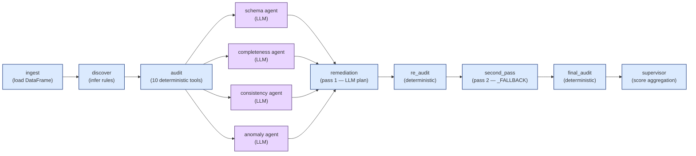
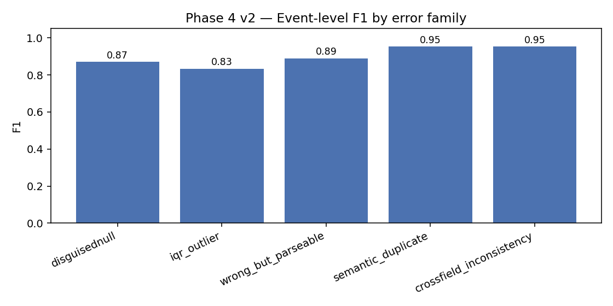
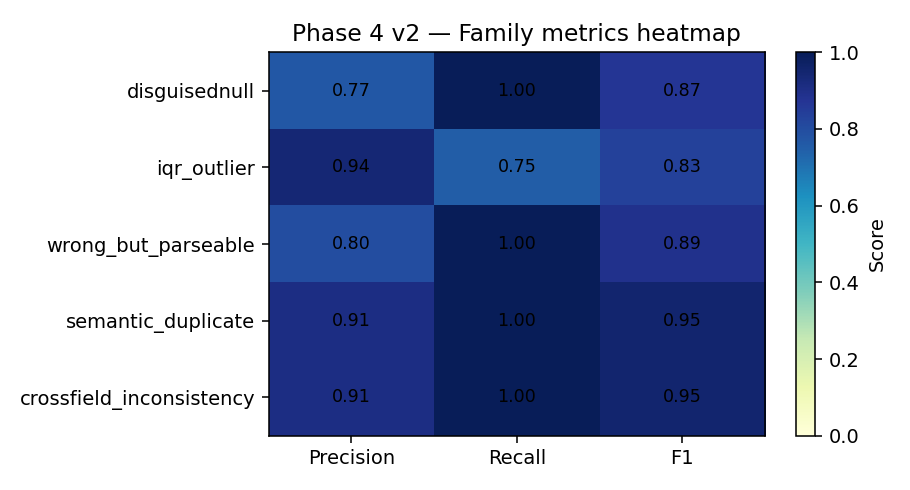

# Agents for Data Quality

LUISS — Machine Learning A.A. 2025/26 · Reply Whitehall
Group 17 — Ludovica De Biase, Giuseppe Catrambone, Filippo Lombardo (captain ID 819621)

## [Section 1] Introduction

The system reads a raw CSV (typical NoiPA noise: disguised nulls, currency symbols, mixed date formats, out-of-range values, duplicate rows, cross-column logic violations) and returns two artefacts:

1. a corrected CSV with the anomalies resolved automatically;
2. an HTML quality report with a 0–100 reliability score, a per-category breakdown, the list of detected issues and the log of applied actions.

The design choice is to keep the deterministic checks in front and use the LLM only where contextual reasoning is actually needed. Each of the four LLM agents owns one reliability dimension (Schema, Completeness, Consistency, Anomaly) and picks an action from a closed enum specific to that dimension. Two reasons drove this split. The first is cost: the four-agent path consumes about 3–4k tokens per dataset, whereas an agent-everywhere approach would burn tens of thousands. The second is verifiability: the deterministic layer is benchmarked at the F1 level, the LLM output is JSON-validated against a closed action set, and a rule-based fallback fires whenever the model is unavailable or returns invalid JSON.

## [Section 2] Methods

### From EDA to deterministic tooling

Before designing the multi-agent layer we profiled the four NoiPA fixtures during Phase 2 along four axes: schema structure, completeness, format consistency, disguised-null patterns. The recurring problems we observed in this exploration are the ones the Phase 3 deterministic tools were built to catch.

Recurring issues found in the EDA, mapped to one or more Phase 3 tools:

- *Column-naming convention violations*: mixed casing, special characters, whitespace in headers (`SPESA TOTALE`, `cod imposta ext`, `ente%code`), identifiers starting with a digit (`2cod_imposta`, `3zona`). These break SQL ingestion, attribute-style pandas access, and JSON serialisation.
- *Effective missingness beyond `df.isna()`*: columns frequently carry placeholder tokens like `N.D.`, `?`, `-`, `na`, `null`, `--`, `.`, which `pandas.isna` does not see. A naive null check therefore underestimates true missingness, sometimes by an order of magnitude.
- *Sparse or low-completeness columns*: fields like `note_operatore` and `flag_rischio` in `ALLARMI` (98–99% missing) that imputation cannot help.
- *Temporal inconsistencies* across `RATA`, `mese`, `anno`, `DATA_PARTENZA`, `ANNO_PARTENZA` and similar fields: mixed valid date families coexist in the same column, and invalid encodings parse as strings.
- *Numeric quality problems*: currency symbols inside numeric fields (e.g. `€` in `spesa`), non-numeric strings inside numeric columns (`TOT`), negative values where the domain wants non-negatives, and unusually large outlier values in activation/cessation columns that look like data-entry errors.
- *Cross-column logical inconsistencies*: rows where `INVESTIGATI > ENTRATI` (an arithmetic impossibility), and mismatches between extracted year fragments and companion year fields (`year(DATA_PARTENZA) ≠ ANNO_PARTENZA`).

The Phase 3 layer returns, for every anomaly, a tuple of `(evidence, severity, suggested_fix)` so the LLM agents reason on structured facts instead of raw rows. The current registry has ten tools:

- `check_schema`: validates discovered schema, required columns, duplicate headers, semantic-type mismatches, naming-convention violations.
- `check_nulls`: measures effective missingness combining real `NaN`s with disguised-null tokens.
- `check_sparse_columns`: flags columns whose completeness falls below a configurable threshold.
- `check_formats`: detects invalid temporal values and mixed format families in date / period / datetime fields, with granular sub-labels (ISO, European, US-textual).
- `check_categorical_case_variants`: finds casing or spelling variants in low-cardinality categorical columns.
- `check_categorical_rare_values`: flags categorical values that occur with frequency below 0.1% in otherwise populous columns (e.g. a job title appearing once in thousands of records).
- `check_numeric_validity`: detects non-numeric values, forbidden tokens, and values below domain-known minimum constraints.
- `check_outliers_iqr`: flags statistical outliers via the inter-quartile-range rule.
- `check_duplicates`: detects exact duplicate rows and duplicate business-keys.
- `check_cross_column`: enforces business logic across related fields (year/date consistency, `INVESTIGATI ≤ ENTRATI`).

Discovery is dynamic: `discover_dataset_rules` populates `EXPECTED_SCHEMAS`, `MANDATORY_COLUMNS`, `FORMAT_RULES` and `NUMERIC_RULES` from the input CSV at runtime, so the deterministic layer generalises beyond the four fixture datasets. Nothing is hardcoded against `spesa`, `attivazioniCessazioni`, `ALLARMI` or `TIPOLOGIA_VIAGGIATORE`.

### Architecture

The pipeline is a LangGraph `StateGraph` with 12 nodes (4 LLM, 8 deterministic), single-iteration with two-pass remediation (LLM-driven first, deterministic fallback second):



Node-by-node:

- `ingest` loads the DataFrame into the shared state.
- `discover` inspects a sample of the dataframe and populates the validation registries.
- `audit` runs the ten deterministic tools and accumulates issues in a standardised JSON format.
- The four LLM analysis agents each receive their slice of issues (filtered by `issue_type`), make a single LLM call against a closed enum of allowed actions, and return a JSON plan plus a 0–1 sub-score for their dimension. Per-agent token budget is 500–1000, total per dataset around 3–4k. A rule-based deterministic fallback fires when the LLM returns invalid JSON.
- `remediation` (pass 1, LLM-driven) applies the consolidated plan via atomic tools (`impute_median`, `impute_mode`, `clip_iqr`, `clip_to_min`, `drop_duplicates`, `normalize_dates`, `strip_currency`, `cast_numeric`, `drop_unexpected_columns`, `normalize_categorical`, `ignore`). A pre-flight guard rejects `col=None` plans so a malformed action does not crash the run. A post-LLM safety net overrides the LLM's `ignore` whenever the rationale does not cite an evidence-based reason (>95% missing, cosmetic, column-type mismatch).
- `re_audit` re-runs the ten audit tools on `fixed_df` and counts residual issues from pass 1.
- `second_pass` (deterministic, zero LLM) takes every residual issue with a sensible deterministic fallback and applies it directly. This closes the gap between the LLM's cautious choices and the deterministic floor.
- `final_audit` re-audits `fixed_df` after both passes; this is the audit feeding the supervisor's post-fix score.
- `supervisor` is fully deterministic. It aggregates the five sub-scores using ISO-8000 weights (completeness 30%, consistency 25%, validity 20%, uniqueness 15%, accuracy 10%) and produces three 0–100 metrics: `reliability_score` (pre-fix), `post_reliability_score` (after both passes), and `remediation_score` / `remediation_score_weighted` (resolution-rate metrics).

### Sparsity-aware scoring

Columns above 95% missing values (e.g. `note_operatore`, `flag_rischio` in ALLARMI) are treated as effectively empty: imputing them would inject noise. The LLM agents pick `ignore`, and these issues are not counted in the completeness sub-score. The threshold is `_DEAD_COLUMN_THRESHOLD` in `agents/pipeline.py`. Cosmetic issues (`naming_convention_violation`) follow the same exemption because renaming columns would break downstream references.

### Two scoring axes

A single number rarely tells the whole story. The pipeline reports two metrics that answer different questions.

- *Reliability score* (0–100, ISO-8000 weighted): how clean is the dataset right now. Penalty-based, starts at 100 and subtracts severity-weighted penalties for each residual issue. Sensitive to absolute issue count, so a dataset with many small issues scores low even if all are minor.
- *Remediation score* (0–100): how much of the detected work the pipeline closed, computed as `(issues_pre − issues_post) / issues_pre`. A severity-weighted variant gives more credit to closing critical/high issues than low ones (weights: critical 4, high 2, medium 1, low 0.5).

The two can diverge. A dataset with 100 small issues, 80 of which are resolved, will still have a low reliability score (residual 20 issues × low penalty) and a high remediation score (80% resolved). Reporting both is more informative than choosing one.

### Technology stack

| Component | Choice |
|---|---|
| Agent orchestration | LangGraph |
| LLM backbone | DeepSeek (`deepseek-chat`, V4) via `langchain-openai` (OpenAI-compatible API) |
| Webapp | FastAPI + Server-Sent Events + React 18 (Babel-standalone CDN, no build step) |
| Deterministic layer | pandas + numpy |
| Reporting | Jinja2 → self-contained HTML (PDF via browser print) |
| Language | Python 3.10+ |

### Design exploration

The choices above were not the first attempts. We tried three LLM providers and three demo UIs before settling.

On the LLM side we started with Groq (`llama-3.3-70b-versatile` via `langchain-groq`). Latency was very low and the model size was right, but the free tier hit aggressive rate limits and our key was suspended without notice during multi-agent runs of four close-spaced calls. We then moved to Ollama with Qwen on Google Colab to remove the external dependency entirely. This worked while the Colab session lasted but the sessions disconnected erratically and tunneling Ollama out of Colab to the local notebook added complexity for, in the end, lower quality than llama-3.3-70b on structured-output tasks at the model size we could keep in RAM. DeepSeek finally won. The OpenAI-compatible API drops in via `ChatOpenAI`, the model is read from `DEEPSEEK_MODEL` (default `deepseek-chat`) so swapping to a larger tier is a one-line change, the price is negligible for our four-call pattern, and rate limits are not an issue at our volume. The branches `feature/agents-data-quality`, `ollamacolab` and `deepseek` still hold the traces of these attempts.

The pipeline's value is not specifically tied to DeepSeek: every agent has a rule-based fallback that runs even with the LLM disabled, and it still produces +38.9 average reliability points on the four NoiPA fixtures (tested with `DEEPSEEK_API_KEY=sk-fake`). The provider is swappable in about five lines of `agents/pipeline.py`.

The demo UI went through three iterations. The original Phase 7 was a Streamlit app generated from the notebook with `%%writefile`. It was quick to write but its layout was not flexible enough for a multi-step pipeline visualisation, it did not stream node-by-node updates, and it looked like a prototype. We removed it during cleanup. A first React + FastAPI version (commit `33d0142`) added a live 9-node SSE timeline, a single score and downloadable artefacts, but only the pre-fix score was shown: the user would see 54/100 even after the fixes had reduced issues by 70%, and the `FixedPreview` had hardcoded NoiPA mock columns. The current version, after the Claude Design v2 pass, has a 12-node timeline that includes the LLM agents and both remediation passes, a before/after side-by-side score with reveal animation, sub-score deltas, a dynamic-column `FixedPreview`, and five selectable colour palettes in dev mode. The architectural decision that made the v2 transition possible was the introduction of the deterministic `re_audit` node, which gives the supervisor a real pre/post delta to display.

### Reproducing the environment

The project was developed and tested on Python 3.12.7 (Anaconda base), with the notebook kernel registered as `python3` and pointing to `/opt/anaconda3/bin/python`. Any Python 3.10+ should work; the regex / typing features used are not version-sensitive.

```bash
pip install -r requirements.txt              # into your active env (conda base, venv, ...)
echo "DEEPSEEK_API_KEY=sk-..." > .env        # provider key required for the LLM agents
jupyter lab agents/main.ipynb
```

The notebook is self-contained for the scientific pipeline: data loading, deterministic tools, the v2 benchmark, the LangGraph definition, execution and report generation all live in `agents/main.ipynb`. Code cells are interleaved with text cells that explain the *what* and the *why*.

The webapp demo (FastAPI + React, interactive frontend) starts with:

```bash
uvicorn webapp.server:app --port 8000
# then open: http://localhost:8000
```

The webapp runs the pipeline live on the uploaded CSV (or on the `spesa` demo dataset), shows the 12-node timeline via SSE, a score card with before/after reliability (e.g. `48.0 → 89.4 (+41.4)` on `spesa.csv` with the live LLM), severity breakdown with per-level deltas, a correction log split between first-pass (LLM) and second-pass (deterministic) entries, and the corrected-CSV download.

> Do not use `--reload` during a demo: reload destroys in-memory sessions and the user gets `404 Unknown session_id` between `/upload` and `/run/{sid}`.

`agents/pipeline.py` (extracted from `main.ipynb`) exposes the runtime API used by the webapp: `run_quality_pipeline()`, `stream_quality_pipeline()`, `render_quality_report()`, `quality_graph`, `RELIABILITY_WEIGHTS`. CLI smoke test: `python -m agents.pipeline`.

## [Section 3] Experimental Design

The Phase 4 benchmark validates the deterministic layer before the multi-agent pipeline is built on top of it: if the rules producing the facts the LLM agents reason on are unreliable, the whole pipeline is not.

We compare against two baselines. The first is a *no-op detector* that flags zero anomalies; Precision is undefined and Recall is zero on every family. It is the trivial floor any working system must clear. The second is a *naive pandas baseline* that only uses `df.isna()` for missingness and `pd.to_numeric(errors='coerce')` for numeric validity, with no disguised-null lookup, no format-family classification, no IQR rule, no business-key reasoning, no cross-field arithmetic. Recall is approximately zero on the four families our deterministic layer is specifically designed to catch (disguised-nulls, mixed date formats, semantic duplicates, cross-field inconsistencies); on `wrong_but_parseable` and `iqr_outlier` it is structurally blind because it never inspects value distributions. The second baseline isolates the value added by the rules before any LLM reasoning enters the loop.

The metric is event-level F1 (with Precision and Recall) comparing injected anomalies against detected ones; the six error families covered are listed in the §4 table.

## [Section 4] Results

### Deterministic layer — synthetic benchmark (Phase 4)

Run with `random.seed(42)`, `trials_per_family=5`, on a 500-row sample per dataset; ninety trials in total. Artefacts in `agents/data/benchmark/evaluation_results_v2.json`, regenerated at every notebook run.




| Metric | Value |
|---|---|
| Global F1 | 0.8936 |
| Global Precision | 0.8571 |
| Global Recall | 0.9333 |
| TP / FP / FN | 84 / 14 / 6 |

| error family | TP / FP / FN | Precision | Recall | F1 |
|---|---|---|---|---|
| `disguisednull` | 20 / 6 / 0 | 0.77 | 1.00 | 0.87 |
| `iqr_outlier` | 15 / 1 / 5 | 0.94 | 0.75 | 0.83 |
| `mixed_date_format` | 10 / 0 / 0 | 1.00 | 1.00 | 1.00 |
| `wrong_but_parseable` | 20 / 6 / 0 | 0.77 | 1.00 | 0.87 |
| `semantic_duplicate` | 10 / 1 / 0 | 0.91 | 1.00 | 0.95 |
| `crossfield_inconsistency` | 9 / 0 / 1 | 1.00 | 0.90 | 0.95 |

The deterministic layer captures the bulk of the injected anomalies (Recall 93.33% global, 100% on four of six families). The non-trivial false-positive rate (Precision 0.86) is concentrated on `disguisednull` and `wrong_but_parseable`: the detectors flag suspicious patterns that, on the 500-row sample, look like injected anomalies but are pre-existing artefacts of the host dataset. The single under-recalling family is `iqr_outlier` (Recall 0.75): IQR is sensitive to the distribution and on small samples the fence widens enough to miss some injections. The `mixed_date_format` family hits a perfect score thanks to the granular `classify_format` labels (`iso_datetime` / `eu_datetime` / `us_textual_datetime` / `other_parseable_datetime`). The numbers are not perfect, and that is the right starting point for delegating reasoning to the LLM agents: the pipeline must remain useful when the deterministic facts are imperfect.

### End-to-end pipeline (Phase 5)

We measured the pipeline end-to-end on the four NoiPA test fixtures with the live LLM (`DEEPSEEK_MODEL=deepseek-chat`). These are the numbers the notebook itself prints in Phase 7, fully reproducible from `agents/main.ipynb`. The deterministic fallback path (LLM disabled) gives a similar floor of about +34 to +42 points; with the LLM the model further refines per-column decisions and pushes most datasets above 82. Numbers vary by ±5 points across runs because the LLM is sampled, not seeded.

| Dataset | shape | pre | post (LLM live) | Δ | verdict |
|---|---|---|---|---|---|
| `spesa.csv` | 7,543 × 18 | 48.0 | 89.4 | +41.4 | HIGH |
| `attivazioniCessazioni.csv` | 20,102 × 19 | 45.6 | 88.6 | +43.0 | HIGH |
| `ALLARMI.csv` | 5,080 × 24 | 53.6 | 95.8 | +42.2 | HIGH |
| `TIPOLOGIA_VIAGGIATORE.csv` | 5,095 × 33 | 51.2 | 95.2 | +44.0 | HIGH |

All four datasets reach HIGH reliability (≥70 / 100). Average Δ is +42.65 points. The two-pass remediation, combined with the prompt-v3 design (senior-engineer framing, four NoiPA-specific few-shot examples, tight `ignore` policy with three explicit conditions), gives the LLM a usable starting plan; the deterministic second pass closes any residual issue the LLM left for safety.

Per-dataset sub-score breakdown (post-fix, live LLM):

- spesa: validity 100, completeness 100, consistency 80, uniqueness 80, accuracy 74.
- attivazioniCessazioni: validity 100, completeness 100, consistency 72, uniqueness 80, accuracy 86.
- ALLARMI: validity 100, completeness 100, consistency 92, uniqueness 100, accuracy 78.
- TIPOLOGIA_VIAGGIATORE: validity 100, completeness 100, consistency 92, uniqueness 100, accuracy 72.

`consistency=72` on `attivazioniCessazioni` and `accuracy=72` on `TIPOLOGIA_VIAGGIATORE` reflect residual issues the LLM agents intentionally left untouched (the deterministic floor would have penalised them more). The system surfaces these cases rather than masking them.

Robustness check (LLM disabled, fake key). Running the four datasets with `DEEPSEEK_API_KEY=sk-fake` (every LLM call fails, agents fall back to the deterministic `_FALLBACK` path) still produces HIGH reliability on all four: `spesa` 87.2 (Δ +39.2), `attivazioniCessazioni` 84.4 (Δ +42.0), `ALLARMI` 91.2 (Δ +40.8), `TIPOLOGIA_VIAGGIATORE` 81.6 (Δ +33.6). Average Δ +38.9. The pipeline does not depend on the LLM being available; the deterministic layer is a true floor and the LLM is a refinement on top.

The CSVs in `agents/data/` are test fixtures, not production input. The pipeline runs on demand on any uploaded CSV (notebook or webapp).

### Generalisation check on a synthetic, LLM-generated dataset

The four NoiPA fixtures above are realistic, but they also acted as the development corpus: every prompt iteration, every threshold, every fallback rule was calibrated on the issues these specific datasets surface. To measure how the system behaves on input it has *never* been tuned against, we asked an LLM to produce a synthetic e-commerce orders dataset whose schema, business semantics and distribution are unrelated to NoiPA. The exact prompt is in `GenAI_Usage.md` and the resulting CSV is `agents/data/synthetic/orders.csv` (1 100 rows × 13 columns). The dataset shares no column name, no rule, no domain with the four assigned fixtures.

About 13% of rows were seeded with anomalies covering eight detection categories: disguised nulls, IQR outliers, mixed date formats, wrong-but-parseable numerics, full-row duplicates, ship-before-order inconsistencies, singleton categorical values, and a whitespace-bearing header. The first eight rows hold one distinct anomaly each, so the webapp's "Fixed dataset" preview surfaces the variety of fixes without scrolling. End-to-end with the deterministic fallback path (`DEEPSEEK_API_KEY=sk-fake`):

| pre | post | Δ | issues pre → post | remediation rate |
|---|---|---|---|---|
| 47.2 | 92.6 | +45.4 | 20 → 8 | 60.0% plain · 75.5% severity-weighted |

Nine of the ten deterministic detectors fire on this input. The only one that does not is `check_cross_column`: its rules are NoiPA-specific (`tipologia`, `allarmi`, `attivazioni`), so the 20 cross-field violations stay in the residual issue count and pull the consistency sub-score down to 76. We see this as the right outcome rather than a failure: the pipeline generalises on the dimensions where the rules are dataset-agnostic, and surfaces the limit on the one where they are not, instead of silently masking it. Promoting `check_cross_column` to a discovered ruleset (along the lines of `discover_dataset_rules` for the other tools) is the natural next step and is listed in §5.

## [Section 5] Conclusions

A multi-agent architecture that keeps deterministic checks in front and uses four dimension-specialised LLM agents on top produces a pipeline that has three useful properties at the same time. The rules are discovered dynamically from the input CSV, so the system generalises beyond the test fixtures. Token cost stays bounded at about 3–4k per dataset because each agent only sees its slice of issues. Every agent has a rule-based fallback, so the pipeline runs even when the LLM provider is unavailable. The supervisor produces both a pre and a post score so the user can see whether the pipeline actually helped, not just how clean the input was.

Open questions and future work:

- *Categorical imputation with LLM context.* For critical categorical nulls (e.g. missing `Descrizione`), a second batched LLM touchpoint of about twenty rows per call could infer the value from row context. We left it out because the impact on the reliability score is marginal compared to the token cost.
- *Discovery via LLM.* Today `discover_dataset_rules` uses heuristics only (deterministic, zero tokens). A variant that asks an LLM to look at sample rows and propose `mandatory_columns` / `numeric_rules` / `cross_column_rules` would produce richer rules at the cost of one extra call at the start.
- *Native PDF report.* The current report is HTML with embedded plotly; the PDF is obtained from browser print. A pure-Python pipeline using `reportlab` would close the loop.
- *Conditional rerun loop.* The pipeline is single-iteration. The `re_audit` node closes a half-loop (deterministic post-fix measurement) but does not re-run the LLM plan if the post-fix score is below threshold. A full `remediate → re_audit → if score < threshold re-run agents on post_issues` loop would raise the final score at the cost of one extra round of tokens. We did not implement it because it adds control-flow complexity (early-stopping, max iterations) for marginal gain on the tested datasets.

## Repository structure

```
GROUP-17-Machine-Learning-Project-Captain-ID-819621/
├── README.md                                  ← this file
├── GenAI_Usage.md                             ← prompts submitted to LLMs (test data, webapp design)
├── Agents for Data Quality - Pitch.html       ← final pitch
├── requirements.txt
├── .gitignore
├── .env                                       ← DEEPSEEK_API_KEY=sk-... (gitignored)
├── agents/
│   ├── main.ipynb                             ← single source of truth (scientific pipeline)
│   ├── pipeline.py                            ← runtime module extracted from the notebook (used by webapp)
│   └── data/
│       ├── project_data_quality/              ← spesa.csv, attivazioniCessazioni.csv
│       ├── project_anomaly_detection/         ← TIPOLOGIA_VIAGGIATORE.csv, ALLARMI.csv
│       ├── synthetic/                         ← LLM-generated neutral test set (see §4)
│       │   └── orders.csv                     ← 1 100 rows × 13 cols, ~13 % rows seeded with anomalies
│       └── benchmark/                         ← Phase 4 artefacts (regenerated by notebook)
│           ├── benchmark_family_metrics_v2.csv
│           ├── benchmark_trials_v2.csv
│           ├── evaluation_results_v2.json
│           └── charts/                        ← README figures (PNGs generated by Phase 4)
│               ├── benchmark_family_f1_v2.png
│               └── benchmark_family_heatmap_v2.png
├── webapp/                                    ← FastAPI + React demo (live SSE timeline, before/after scoring)
│   ├── server.py                              ← FastAPI app: /upload, /demo, /run/{sid} (SSE), /download/*
│   ├── adapters.py                            ← pipeline final_state → React JSON shape
│   ├── sessions.py                            ← in-memory session store
│   └── static/                                ← single-page React app (Babel-standalone, no build step)
│       ├── index.html
│       ├── app.jsx                            ← phase orchestrator + SSE consumer + palette switcher
│       ├── data.js                            ← pipeline node definitions (12 nodes)
│       ├── screens-intro.jsx                  ← welcome + dataset preview
│       ├── screen-pipeline.jsx                ← live timeline (3-group flow: det → llm → det)
│       ├── screen-results.jsx                 ← results dashboard (before/after score, severity, log)
│       ├── tweaks-panel.jsx                   ← dev panel (visible with ?dev=1)
│       └── styles.css
└── docs/
    ├── ML Projects general info.docx.pdf
    └── Reply_projects.pdf
```

Branches that hold the experimental traces (not all merged into `Main`):

- `feature/agents-data-quality` — earliest multi-agent implementation with Groq.
- `ollamacolab` — Ollama + Qwen on Google Colab experiment (Phase 4 completed, then abandoned).
- `deepseek` — Groq → DeepSeek switch (later merged into `Main`).
