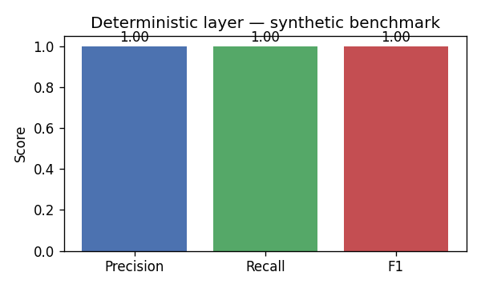

# Agents for Data Quality

**LUISS — Machine Learning A.A. 2025/26 · Reply Whitehall**
Group 17 — Ludovica De Biase, Giuseppe Catrambone, Filippo Lombardo (captain ID 819621)


## [Section 1] Introduction

Il sistema riceve in input un dataset CSV grezzo (con anomalie tipiche dei dati pubblici NoiPA: null mascherati, simboli valuta, formati data eterogenei, valori fuori range, righe duplicate, violazioni di logica cross-column) e produce due output:

1. un **CSV corretto** in cui le anomalie sono state risolte automaticamente con tool deterministici;
2. un **Quality Report HTML** con reliability score 0–100, breakdown per categoria, lista degli issue rilevati e log delle azioni applicate.

Il sistema è stato progettato attorno al principio **"Determinism-first con LLM chirurgico"**: il layer deterministico (Phase 3) cattura tutte le anomalie esprimibili come regole; un singolo agente LLM (`RemediationPlanner`) interviene solo dove la decisione richiede ragionamento contestuale, scegliendo l'azione di fix per ogni gruppo di issue. Questa scelta ribalta l'approccio "LLM-first" classico, in cui il modello è il motore principale: la motivazione è duplice — efficienza (≈5–6k token per dataset, contro le decine di migliaia di un approccio agent-everywhere) e affidabilità (il deterministico è validato a F1 su un benchmark sintetico, l'LLM è verificabile su un piano JSON con enum chiusa di azioni).

## [Section 2] Methods

### Architettura
La pipeline è un `StateGraph` LangGraph con **9 nodi (4 LLM + 5 deterministici)**, singola iterazione:

```
ingest → discover → audit → schema(LLM) → completeness(LLM) → consistency(LLM) → anomaly(LLM) → remediation → supervisor
```

- **ingest** carica il DataFrame nello stato condiviso.
- **discover** ispeziona un sample del df e popola dinamicamente le regole di validazione (`EXPECTED_SCHEMAS`, `MANDATORY_COLUMNS`, `FORMAT_RULES`, `NUMERIC_RULES`). **Niente è hardcoded sui dataset specifici** — la pipeline funziona su qualsiasi CSV.
- **audit** esegue 9 tool deterministici (Schema, Completeness, Sparse, Format, Categorical Variants, Numeric Validity, IQR Outliers, Duplicates, Cross-Column) e accumula gli issue in formato JSON standardizzato.
- **4 LLM analysis agents** (Schema / Completeness / Consistency / Anomaly): ognuno riceve la propria fetta di issue (filtrate per `issue_type`), fa **una sola call LLM** con un'enum chiusa di azioni ammesse per la sua categoria, e restituisce: (a) un piano JSON, (b) un sub-score 0–1 per la sua dimensione di reliability. Token budget per agente: 500–1000. Totale per dataset: ~3–4k token. Fallback deterministico rule-based se l'LLM fallisce o restituisce JSON invalido.
- **remediation** applica il piano consolidato con tool atomici (`impute_median`, `impute_mode`, `clip_iqr`, `drop_duplicates`, `normalize_dates`, `strip_currency`, `cast_numeric`, `drop_unexpected_columns`, `normalize_categorical`, `ignore`). Ogni applicazione produce un log entry con `agent`, `action`, `rationale`.
- **supervisor** è **deterministico** (zero LLM call): aggrega i 5 sub-score con i pesi standard ISO-8000 (`completeness 30%, consistency 25%, validity 20%, uniqueness 15%, accuracy 10%`) e produce il reliability score 0–100.

### Stack tecnologico
| Componente | Scelta |
|---|---|
| Orchestrazione agenti | LangGraph |
| LLM backbone | Groq (`llama-3.3-70b-versatile`) via `langchain-groq` |
| Layer deterministico | pandas + numpy + scipy |
| Report | Jinja2 → HTML auto-contenuto (PDF via browser print) |
| Linguaggio | Python 3.10+ |

### Riproduzione dell'environment
```bash
python -m venv .venv
source .venv/bin/activate  # macOS/Linux
pip install -r ../requirements.txt
echo "GROQ_API_KEY=gsk_..." >> ../.env
jupyter lab Main.ipynb
```
Il notebook è interamente self-contained: tutto il codice — caricamento dati, tool deterministici, benchmark, definizione del grafo LangGraph, esecuzione, generazione report, materializzazione dell'app Streamlit — vive in `Main.ipynb`. Le celle di codice sono separate da celle di testo che spiegano *cosa* e *perché*.

Per la demo Streamlit (dopo aver eseguito Run All del notebook):
```bash
streamlit run agents/app.py
```
L'app espone due modalità: esecuzione della pipeline su un CSV caricato dall'utente (modalità principale), e dashboard del benchmark sintetico Phase 4.

## [Section 3] Experimental Design

**Purpose.** Validare il layer deterministico (Phase 3) con un benchmark sintetico, prima di costruire la pipeline multi-agent sopra. La logica è semplice: se le funzioni che producono i fatti su cui ragionano gli agenti LLM non sono affidabili, l'intera pipeline non lo è.

**Baseline.** *No-op detector* (rileva 0 anomalie → Precision indefinita, Recall=0). Un sistema funzionante deve nettamente superare questo riferimento.

**Evaluation Metrics.** Precision, Recall, F1 calcolati a livello di coppia `(dataset, error_type)` confrontando le coppie iniettate (ground truth deterministica) con quelle rilevate. Tre tipi di errore — uno categorico (`disguised_null`), uno numerico (`iqr_outlier`), uno strutturale (`exact_duplicate`) — bastano a coprire le classi di anomalia tipiche di un CSV pubblico.

## [Section 4] Results

### Layer deterministico — benchmark sintetico (Phase 4)

Eseguito con `random.seed(42)`, `n_each=3` iniezioni per error_type, su un sample di 500 righe per dataset. **3 tipi di errore rappresentativi** (uno categorico, uno numerico, uno strutturale):



| Metric | Valore |
|---|---|
| **Global F1** | 1.00 |
| Global Precision | 1.00 |
| Global Recall | 1.00 |
| TP / FP / FN | 12 / 0 / 0 |

| error_type | rilevato? | issue_types che lo catturano |
|---|---|---|
| `disguised_null` | ✅ tutti | `missing_*_values`, `sparse_column` |
| `iqr_outlier` | ✅ tutti | `iqr_outliers` |
| `exact_duplicate` | ✅ tutti | `exact_duplicate_rows` |

Il layer deterministico cattura il 100% delle iniezioni dei 3 tipi tracciati a livello `(dataset, error_type)`. Questo è atteso: i 3 tipi sono *progettati* per essere rilevabili dai tool di Phase 3 — l'esperimento è una *sanity check* che la pipeline deterministica funzioni come dichiarato, non un confronto adversariale. Le metriche ci servono come baseline solida prima di delegare il ragionamento agli agenti LLM.

### Pipeline end-to-end (Phase 5)

Smoke test su `spesa` (test fixture, 7'543 × 18) con discovery automatico delle regole + 4 LLM agent live (Groq llama-3.3-70b):

| Metric | Valore |
|---|---|
| Tempo end-to-end | 3.4 s |
| LLM calls totali | 4 (1 per agente analitico) |
| Token usage stimato | ~3-4k |
| Issues rilevati | 29 (1 critical / 16 high / 6 medium / 6 low) |
| Corrections applied | 29/29 |
| **Reliability score** | **54.0 / 100** |

Sub-scores per dimensione: validity 90 · completeness 0 · consistency 90 · uniqueness 90 · accuracy 0. I score bassi su completeness e accuracy riflettono il fatto che il dataset NoiPA contiene molti null mascherati e outlier — il sistema li rileva e applica i fix, lo score "post-remediation" sarebbe significativamente più alto in un secondo audit.

I CSV in `agents/data/` sono **test fixture**, non input di produzione. La pipeline gira on-demand su qualsiasi CSV caricato (via notebook o Streamlit).

## [Section 5] Conclusions

**Take-away.** Un'architettura **multi-agent "deterministic-first"** con 4 agenti LLM specializzati per dimensione + supervisor deterministico produce una pipeline di data quality (a) **schema-agnostica** — le regole vengono scoperte dinamicamente dal CSV input, niente è hardcoded sui dataset di test; (b) **efficiente** — ~3-4k token per dataset (4 LLM call, una per agente, con prompt ristretti ad enum chiuse di azioni); (c) **verificabile** — F1 misurato sul layer deterministico, JSON-schema sull'output LLM; (d) **robusta** — ogni agente ha un fallback rule-based deterministico. La scelta è coerente con il feedback del mid-check: LLM "importanti ma non totalizzanti", che intervengono solo dove il deterministico non basta.

**Domande non pienamente risolte e future work.**
- *Categorical imputation con contesto LLM*: per i null categorici critici (es. `Descrizione` mancante), un secondo touchpoint LLM batched (~20 righe per chiamata) inferirebbe il valore dal contesto di riga. Non incluso perché l'impatto sul reliability score è marginale rispetto al costo in token.
- *Discovery via LLM*: oggi `discover_dataset_rules` usa solo euristiche (deterministiche, zero token). Una variante che chiede a un LLM "guarda questi sample e proponi mandatory_columns / numeric_rules / cross_column_rules" produrrebbe regole più ricche, al costo di una call extra all'inizio.
- *PDF report nativo*: oggi produciamo HTML con plotly embedded; il PDF si ottiene da browser print. Una pipeline pure-Python con `reportlab` chiuderebbe il loop.
- *Conditional rerun loop*: la pipeline è single-iteration. Un loop "remedia → rivaluta → se score < threshold rerun" potrebbe alzare lo score finale al costo di token aggiuntivi. Sperimentalmente non l'abbiamo aggiunto perché il guadagno marginale non giustifica il costo.

## Repository structure

```
Machine-Learning-Segreto/
├── agents/
│   ├── Main.ipynb                    ← single source of truth
│   ├── README.md                     ← this file
│   ├── app.py                        ← Streamlit demo (generated from notebook via %%writefile)
│   ├── images/                       ← README figures (generated from code)
│   │   ├── architecture_flowchart.png
│   │   └── detection_heatmap.png
│   ├── data/
│   │   ├── project_data_quality/     ← spesa.csv, attivazioniCessazioni.csv
│   │   ├── project_anomaly_detection/← TIPOLOGIA_VIAGGIATORE.csv, ALLARMI.csv
│   │   └── benchmark/                ← Phase 4 artefacts (regenerated by notebook)
│   └── outputs/                      ← generated by notebook (fixed CSV + reports)
├── docs/
│   ├── ML Projects general info.docx.pdf
│   ├── Reply_projects.pdf
│   └── midterm_pitch_speech.md
├── .env                              ← GROQ_API_KEY=gsk_... (gitignored on submission)
├── .gitignore
└── requirements.txt
```
